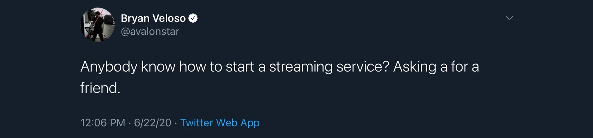
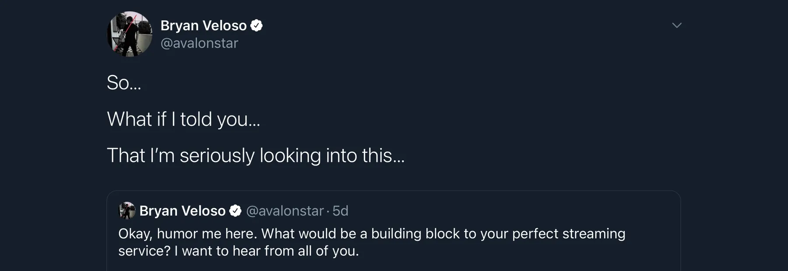

Over the course of a single week, I determined my fate for at least the next five years of my life.

A week ago, [I joked about how to start a streaming service from scratch](https://twitter.com/avalonstar/status/1275143205227388928). A day later that joke would form the foundations of what is now known as [altair.tv](https://altair.tv)---or **Project Altair.**

I mean, that's how these things work in 2020 right? One day, you're streaming Destiny, wondering how the heck you're ever going to get 100 concurrent viewers. The next day, the entire gaming community is lit [ablaze by the stories of brave women coming forward to painfully detail the systemic abuses within the industry](https://twitter.com/JessyQuil/status/1275638188187496450). [Then Mixer suddenly shuts down](https://twitter.com/WatchMixer/status/1275134189738713088). Couple that with all of one's anger with the status quo in the tech industry built over the course of a decade---along with being in the midst of a deadly pandemic running rampant due to the failure of our public institutions. Who *wouldn't* want to start a content creation platform?

## Alright then, why?

**Because I feel there needs to be an alternative built with a different set of principles.** I say this being mindful of where I came from. I gave almost two years of my time to Twitch as a staff member, and the last four as a full-time content creator on the platform. But I also say this as Facebook's 27th employee, and a GitHub alumni. Through my freelance work I've found both inspiration and disgust in the core principles of my clients.

### January 2020 feels like a decade ago.

I came into 2020 with my mind fully in nostalgia mode, with it being avalonstar.com's 20th year. There was this prevailing thought that I could bring every aspect that made Avalonstar what it was over the last 20 years and merge them together. Design, development, education, content creation. All of it. [So, I brought back avalonstar.com this year.](https://avalonstar.com/blog/2020/rebooted) I started designing and developing more on my Twitch channel. I jumped back into the trials and tribulations of application development after a 7 year absence.

But then the other shoe dropped. I didn't even know it was even there **to** drop.

Everything I've listed above---it was all a catalyst. I got a Bachelor's degree in Entrepreneurship because I didn't want to be taught my web design hobby. My mind has been waiting for an opportunity like this: to take the lump sum of experience, of pain, of inspiration from the last two decades and put it to use as more than just the pillars of a soapbox.

### My (albeit jaded) 30,000 foot view.

So back to why I'm doing this. I've looked at every other company in the industry that's come up, past and present. From Hitbox, to Mixer, to Caffeine, to Dlive. If you were to strip down every one of those companies, their core model is the same. They're for-profit enterprises that've taken venture capital from firms. They launch, they hire fast, they make a profit, and they exit (by getting bought), and everybody wins right? Well... if I received a dime for every time I heard the phrase "Amazon ruined Twitch" or "Microsoft ruined Mixer," I'd never need another dime to run Altair.

Let's approach this from another angle. How do these companies make money? Obviously, they're ad supported in one way or another, so there's an entire staff being paid for that trade. They take a cut of a creator's revenue, the amount of which is usually a badly kept secret. So the more money a creator makes, the more the company makes. Since all the above companies are for-profit enterprises, that's good for them. But it poisons so many other aspects that in the social media age, we're just used to. Applying terms of service equally amongst all creators, and generally just being beholden or even handcuffed to the large entities bankrolling you.

The number of times I've seen a company shift from cultivating to then cannibalizing their own users for the sake of growth---it's been nauseating, but it's the status quo. It's the way business is done. Companies celebrate getting money from venture capitalists before they even have a revenue model. And of course, streaming and content delivery is just too expensive to do it any other way. The cycle repeats, again, and again. We love a company, only to eventually hate it for becoming too big and then end up moving on. And for those of us who want to try something different, the coffin has been nailed shut before we ever had a chance to live.

**I do not accept this worldview.**

## The sum of my parts.

Maybe the sum of my parts is stupidity. Maybe there's something there. Maybe I'm just fooling myself and taking everybody for a ride. However, if there's anything that has stayed consistent with me over the years: I am too damn stubborn to compromise on my principles for the sake of money. Call me whatever you call people like me these days, but throughout my career *I've believed in people*.

It's 2020, I'm sure you're waiting for a punchline. But there isn't one. With the help and advice of many amazing people that I've met over the last 20 years, I am taking hold of this industry and shaking it down to its core.

> Altair will be a **social** enterprise.

I want to create a service that is **mindful**. Our primary focus? It won't be profit (as in, that specific line on a balance sheet), it will be **people**. As a designer who has by association contributed to the social media wasteland we are now standing in---where people have to take breaks from platforms because the entire industry is run on tracking, and metrics---I have a duty to try and create a service that pays respect to a creator's mind. To a viewer's mind. The minds of **our** stakeholders.

### An example: Partnership.

Why are we creating **artificial scarcity** to drive creators to achieve **artificial goals** that do nothing but create a caste system of the haves and the have-nots? The current platforms aren't supporting organic and healthy growth. They hang fruit in front of us and we have to jump for it. We miss it, and jump again, and again, and again. And once we finally grab that fruit? It's hollow and rotten. That's "the road to partnership." You hit it, you celebrate, and then everybody disappears for 3 months. I don't speak for myself as Twitch partner, but on behalf of the hundreds of "streaming service partners" I've met who have been disenfranchised by the promise of partnership.

Why are we okay with any of this? Because it works? Because it makes money? Because they make a select few successful? Because that's the status quo? Let me reel myself back in here. (I'm feeling like this would've made a good vlog. This is what I get for listening to the Final Fantasy VII Remake soundtrack while writing this.)

## Marching forward.

At the end of the day, Altair is going to go forward, and as you can see I'm passionate about it. I firmly believe in the idea that a platform should be mindful of the people who use it, and the people who create on it. I firmly believe that when one pays into a platform, that they know what they're getting out of it. I firmly believe that creators have earned a place where they can feel safe with their communities without the company or external bad actors exerting undue pressure on them.

> They say I'm a dreamer, but I'm not the only one.

Cheesy, but true.

Ultimately, this could fail. I am painting myself into a *very* small corner and taking huge risks. The doubters are already there, and their opinions are valid. But I'm not so much worried about us failing as a business as I am failing to move the needle forward. Technology is a solvable problem if things break, but values aren't.

If Altair were to live and die in the blink of an eye, I'd at least want the next place our creators choose to be better than it was today. I want content creation as an industry to move in a positive direction, one that supports and shields its creators from abuse. That lifts creators up to be the best they can be, instead of weighing them down with arbitrary goals.

This is the journey I'm embarking on. While I'm terrified, I'm ready. While I'll miss what I'm leaving behind, I'm ready.

This is where I need to be right now.
